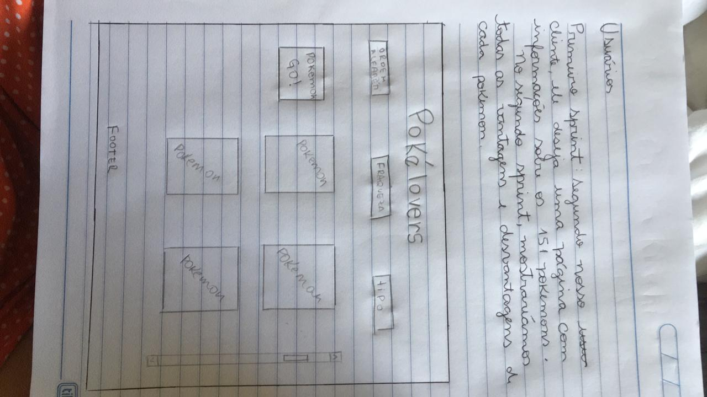
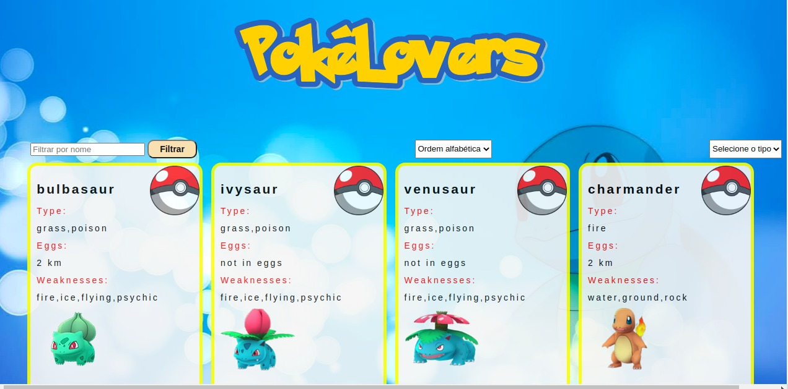

# Pokélovers

## Índice

* [1. Introdução](#1-Introdução)
* [2. Usuário](#2-Usuário)
* [3. Objetivos](#3-objetivos)
* [4. Teste de usabilidade](#4-teste-de-usabilidade)
* [5. Desenvolvido com](#5-desenvolvido-com)
* [6. Desenvolvedoras](#6-desenvolvedoras)

*

## 1. Introdução

Segundo projeto realizado para Laboratoria. Este projeto consiste na apresentação de um dashboard de Pokémons, com as funcionalidades
de filtro, organização de cards e cálculo estatistico. Performado em dupla, e com opções entre pokemon, rick and morty e lol, optamos pelo tema pokemon. Mas por que Pokémon?

Esta franquia enorme nasceu no Japão, criação do Satoshi Tajihi, em meados de 1995. Este
inicialmente foi desenvolvido para os games da nintendo, onde o treinador capturava, treinava e colocava em combate os pokémons(nome provido das palavras em japonês Poketto monsutã). Logo virou febre, pois afinal, quem consegue resistir ao pikachu né! 

Então optamos por esse tema para desenvolver nossa história de usuario, uma vez que provavelmente mais pessoas conheceriam esse tema.

## 2. Usuário

Para a base desse projeto, decidimos iniciar com o usuário, persona, para termos uma ideia dos sites que eles visitavam, o que procuravam, por que se interessaram por esse tema.

Então, desenvolvemos um formulario para captar a visão de um montante amostral sobre o tema.

### Protótipo de baixa fidelidade

### Implementação da interface de usuário (HTML/CSS/JS)

## 3. Objetivos 

O objetivo principal da aplicação é oferecer uma interface intuitiva e divertida que proporcione ao usuário uma ferramenta de pesquisa e consulta e traga informações relevantes sobre os Pokémons para melhor performance no game Pokemon GO.

## 4. Testes de usabilidade

Foram realizados testes de usabilidade, onde foi identificada a necessidade de exibir todos os cards, portanto optamos por ter apenas uma página inicial, contendo todos os cards para a visualização da imagem, nome do pokemon e todas as características necessárias de cada um.
Para que a pesquisa pudesse ser feita pelo nome, inserimos campo para a digitação, onde é possível digitar as iniciais de cada nome clicando no botão que trás o resultado da pesquisa. Disponibilizamos pesquisa por tipo e ordem alfabética.

Exibimos também uma parametro que ao utilizar o filtro de tipagem o usuário saberá em porcentagem quantos pokemons são daquela espécie.

Este é o resultado final do layout:

## 5. Desenvolvido com

* [JavaScript](https://developer.mozilla.org/pt-BR/docs/Web/JavaScript)
* [HTML](https://developer.mozilla.org/pt-BR/docs/Glossary/HTML)
* [CSS](https://developer.mozilla.org/pt-BR/docs/Web/CSS)

## 6. Desenvolvedoras

  * Camila 
  
 
  
 <b>Elis Brasil</b> 

  

 

